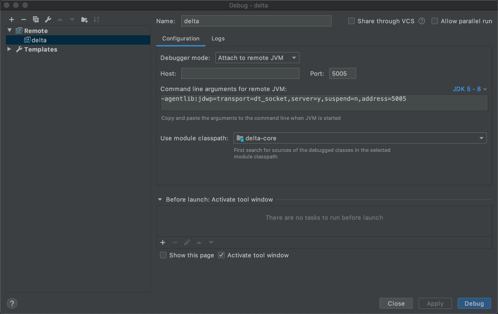

# Demo: Debugging Delta Lake Using IntelliJ IDEA

Import Delta Lake's [sources](https://github.com/delta-io/delta) to IntelliJ IDEA.

Configure a new Remote debug configuration in IntelliJ IDEA (e.g. Run > Debug > Edit Configurations...) and simply give it a name and save.

!!! tip
    Use `Option+Ctrl+D` to access Debug menu on mac OS.



Run `spark-shell` as follows to enable remote JVM for debugging.

```text
export SPARK_SUBMIT_OPTS=-agentlib:jdwp=transport=dt_socket,server=y,suspend=n,address=5005
```

```text
spark-shell \
  --packages io.delta:delta-core_2.12:{{ delta.version }} \
  --conf spark.sql.extensions=io.delta.sql.DeltaSparkSessionExtension \
  --conf spark.sql.catalog.spark_catalog=org.apache.spark.sql.delta.catalog.DeltaCatalog \
  --conf spark.databricks.delta.snapshotPartitions=1
```
