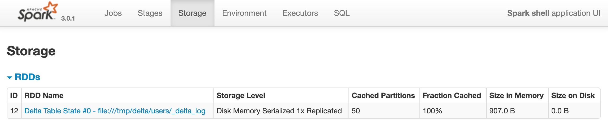

# Demo: DeltaTable, DeltaLog And Snapshots

## Create Delta Table

```text
import org.apache.spark.sql.SparkSession
assert(spark.isInstanceOf[SparkSession])

val name = "users"
sql(s"DROP TABLE IF EXISTS $name")
sql(s"""
    | CREATE TABLE $name (id bigint, name string, city string, country string)
    | USING delta
    """.stripMargin)
```

## Access Transaction Log (DeltaLog)

```text
import org.apache.spark.sql.catalyst.TableIdentifier
val tid = TableIdentifier(name)

import org.apache.spark.sql.delta.DeltaLog
val deltaLog = DeltaLog.forTable(spark, tid)
```

Update the state of the delta table to the most recent version.

```text
val snapshot = deltaLog.update()
assert(snapshot.version == 0)

val state = snapshot.state
```

```text
scala> :type state
org.apache.spark.sql.Dataset[org.apache.spark.sql.delta.actions.SingleAction]
```

Review the cached RDD for the state snapshot in the Storage tab of the web UI (e.g. http://localhost:4040/storage/).



The "version" part of **Delta Table State** name of the cached RDD should match the version of the snapshot

```text
// Show the changes (actions)
scala> snapshot.state.show
+----+----+------+--------------------+--------+----------+
| txn| add|remove|            metaData|protocol|commitInfo|
+----+----+------+--------------------+--------+----------+
|null|null|  null|                null|  [1, 2]|      null|
|null|null|  null|[5156c9e3-9668-43...|    null|      null|
+----+----+------+--------------------+--------+----------+
```

## DeltaTable as DataFrame

```text
import io.delta.tables.DeltaTable
val dt = DeltaTable.forName(name)
```

```text
scala> dt.history.select('version, 'operation, 'operationParameters, 'operationMetrics).show(truncate = false)
+-------+-------------------+------+--------+------------+--------------------+----+--------+---------+-----------+--------------+-------------+----------------+------------+
|version|          timestamp|userId|userName|   operation| operationParameters| job|notebook|clusterId|readVersion|isolationLevel|isBlindAppend|operationMetrics|userMetadata|
+-------+-------------------+------+--------+------------+--------------------+----+--------+---------+-----------+--------------+-------------+----------------+------------+
|      0|2020-09-29 10:31:30|  null|    null|CREATE TABLE|[isManaged -> tru...|null|    null|     null|       null|          null|         true|              []|        null|
+-------+-------------------+------+--------+------------+--------------------+----+--------+---------+-----------+--------------+-------------+----------------+------------+
```

```text
val users = dt.toDF
```

```text
scala> users.show
+---+----+----+-------+
| id|name|city|country|
+---+----+----+-------+
+---+----+----+-------+
```

## Add new users

```text
val newUsers = Seq(
  (0L, "Agata", "Warsaw", "Poland"),
  (1L, "Bartosz", "Paris", "France")
).toDF("id", "name", "city", "country")
```

```text
scala> newUsers.show
+---+-------+------+-------+
| id|   name|  city|country|
+---+-------+------+-------+
|  0|  Agata|Warsaw| Poland|
|  1|Bartosz| Paris| France|
+---+-------+------+-------+
```

```text
newUsers.write.format("delta").mode("append").saveAsTable(name)
assert(deltaLog.snapshot.version == 1)
```

Review the cached RDD for the state snapshot in the Storage tab of the web UI (e.g. http://localhost:4040/storage/).

The "version" part of **Delta Table State** name of the cached RDD should match the version of the snapshot

```text
scala> users.show
+---+-------+------+-------+
| id|   name|  city|country|
+---+-------+------+-------+
|  1|Bartosz| Paris| France|
|  0|  Agata|Warsaw| Poland|
+---+-------+------+-------+
```

```text
scala> dt.history.select('version, 'operation, 'operationParameters, 'operationMetrics).show(truncate = false)
+-------+------------+------------------------------------------------------------------------+-----------------------------------------------------------+
|version|operation   |operationParameters                                                     |operationMetrics                                           |
+-------+------------+------------------------------------------------------------------------+-----------------------------------------------------------+
|1      |WRITE       |[mode -> Append, partitionBy -> []]                                     |[numFiles -> 2, numOutputBytes -> 2299, numOutputRows -> 2]|
|0      |CREATE TABLE|[isManaged -> true, description ->, partitionBy -> [], properties -> {}]|[]                                                         |
+-------+------------+------------------------------------------------------------------------+-----------------------------------------------------------+
```
